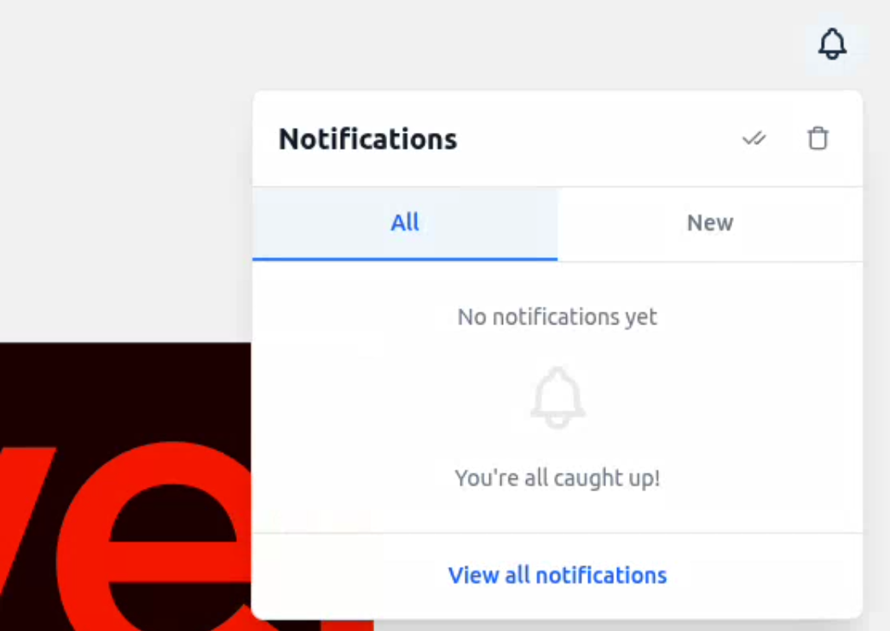
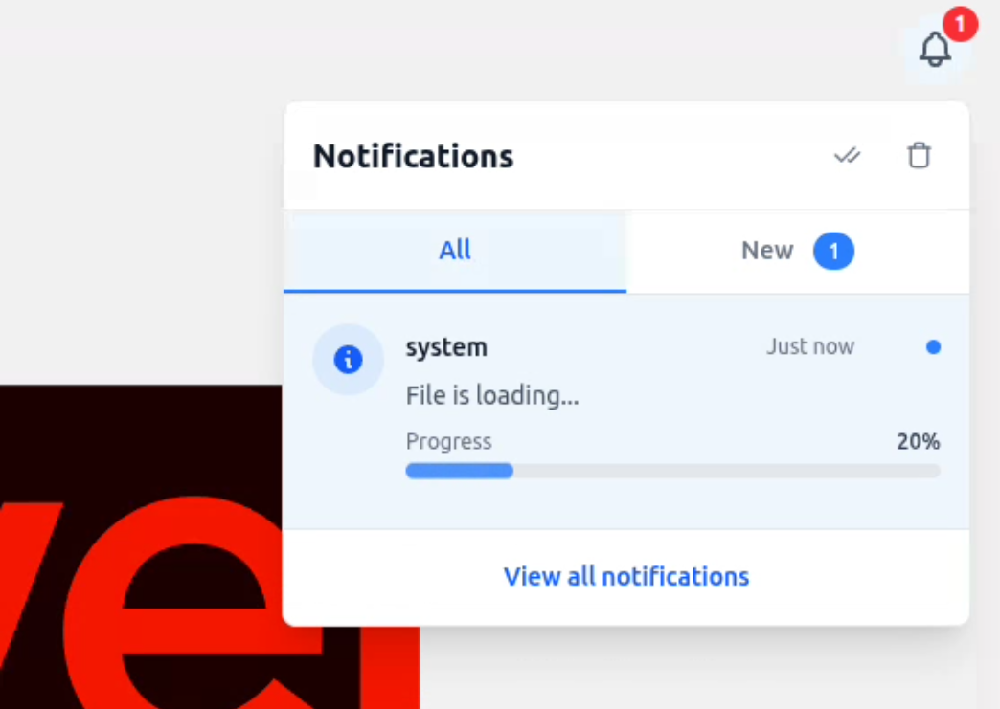
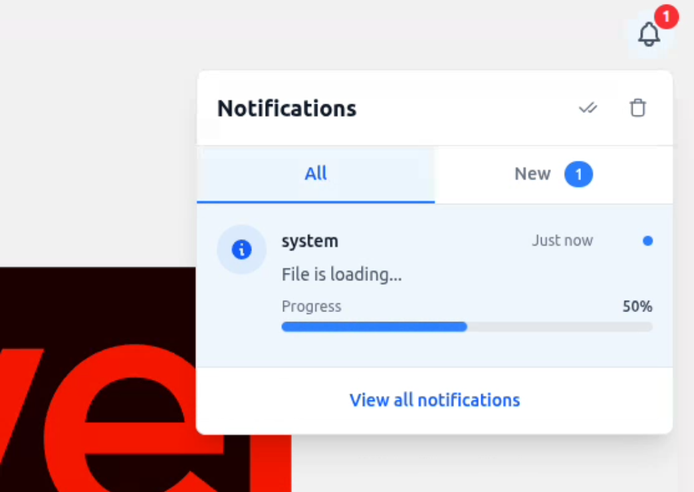
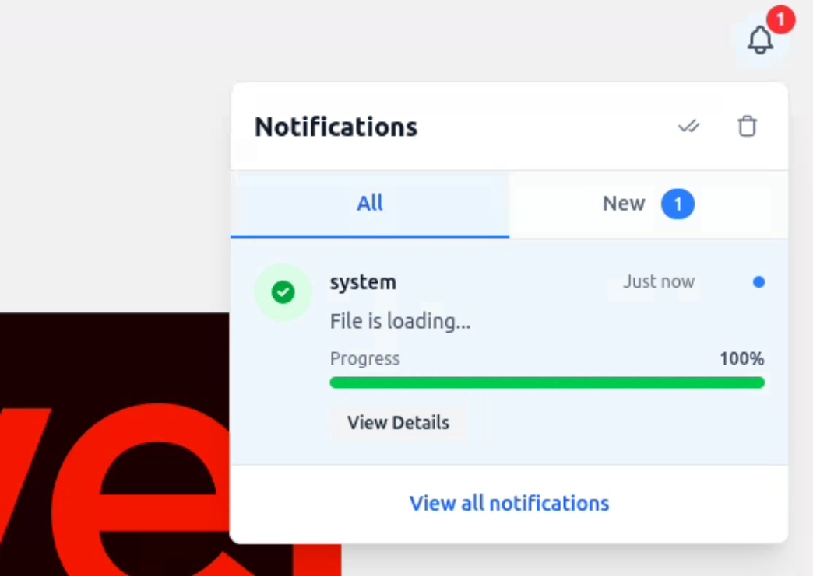

# Notification Package

A Laravel package for handling notifications across multiple Laravel versions.









## Installation

Add repository in `composer.json` file.

```
"repositories": [
  ...
   {
            "type": "vcs",
            "url": "https://github.com/w99910/laravel-notifications-server.git"
   },
]
```

Then install the package.

```bash
composer require thomasbrillion/notification
```

## Publishing Assets

```bash
php artisan vendor:publish --provider="Thomasbrillion\Notification\NotificationServiceProvider"
```

Or

```bash
php artisan vendor:publish --tag="notification"
```

## Preparation

If you are already using laravel notifications table, change the table name in `config/notification.php`.

```php
[
   'table_name' => 'your-project-notifications',
]
```

If you are using different Eloquent model, you can specify your class in `config/notification.php`.

```php
[
  'models' => [
     'notification' => YourNotificationModel::class,
  ]
]
```

> Important: Your notification model should implement `Thomasbrillion\Notification\Interface\Models\NotificationInterface`.

This library includes required routes to interact with notifications via API.

```
GET|HEAD   notifications ............................................................ notifications.get › Thomasbrillion\Notification\Controllers\NotificationController@getNotifications
GET|HEAD   notifications/count ................................................ notifications.count › Thomasbrillion\Notification\Controllers\NotificationController@getNotificationCount
POST       notifications/delete ................................................ notifications.delete › Thomasbrillion\Notification\Controllers\NotificationController@deleteNotification
POST       notifications/delete-all ..................................... notifications.deleteAll › Thomasbrillion\Notification\Controllers\NotificationController@deleteAllNotifications
GET|HEAD   notifications/read .............................................. notifications.read.get › Thomasbrillion\Notification\Controllers\NotificationController@getReadNotifications
POST       notifications/read ....................................................... notifications.read.post › Thomasbrillion\Notification\Controllers\NotificationController@markAsRead
POST       notifications/read-all .............................................. notifications.markAllRead › Thomasbrillion\Notification\Controllers\NotificationController@markAllAsRead
GET|HEAD   notifications/unread ............................................ notifications.unread › Thomasbrillion\Notification\Controllers\NotificationController@getUnreadNotifications
GET|HEAD   notifications/user ............................................................. notifications.user › Thomasbrillion\Notification\Controllers\NotificationController@getUserId
```

## Usage
